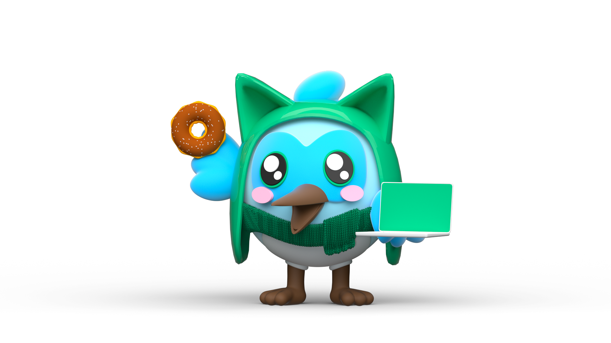

# Flutter Portfolio

A Flutter web app showcasing how to build a responsive portfolio website for various screen sizes and operating systems. This project features animations and a sleek design, highlighting Flutter's capabilities in creating versatile and visually appealing web applications.

## Live Demo
You can find a live version of this project as website on [Click to view the Portfolio](https://heshamerfan97.github.io/)

#### Road Map:
- ~~Loading Animations~~
- ~~Home~~
- ~~Projects~~
- ~~Repositories~~
- ~~Contacts~~
- Vlogs
- Dark Theme
- Localization
- Unit Testing
- Widget Testing
- Integration Testing
---

## Key Features
**Responsive Design**: The app adapts seamlessly to different screen sizes and orientations, ensuring a consistent user experience across desktops, tablets, and mobile devices.

**Smooth Animations**: Engaging animations enhance the user experience, making navigation through the portfolio interactive and visually appealing.

**Well-Structured Code**: The codebase follows best practices, Using state management with bloc/cubit and is well-organized, making it easy to maintain and extend.

**Attractive Landing Page**: A welcoming landing page that introduces you and your work, setting the stage for the rest of the portfolio.

**Project Showcase**: Includes detailed sections for showcasing your projects, providing visitors with insights into your work and skills.

**GitHub Repositories**: Integrated links to your GitHub repositories, allowing visitors to explore your open-source contributions and code samples.

**Contact Information**: Easily accessible contact information, enabling potential employers or collaborators to reach out to you.

---

## Technologies and Packages Used

### Technologies

- **[Flutter](https://flutter.dev/)**: The core framework used for building the web application, providing a rich set of pre-designed widgets and tools for a seamless development experience.
- **[Dart](https://dart.dev/)**: The programming language used with Flutter, known for its fast performance and robust features.

### Packages

- **[bloc](https://pub.dev/packages/bloc)**: A predictable state management library that helps implement the Business Logic Component (BLoC) design pattern.
- **[flutter_bloc](https://pub.dev/packages/flutter_bloc)**: Built to integrate the bloc library seamlessly with Flutter, providing widgets to easily manage and rebuild UI components based on state changes.
- **[dio](https://pub.dev/packages/dio)**: A powerful HTTP client for Dart, which supports various features such as interceptors, global configuration, FormData, request cancellation, file downloading, and timeout configuration.
- **[flutter_svg](https://pub.dev/packages/flutter_svg)**: Allows the use of SVG (Scalable Vector Graphics) in your Flutter app, providing high-quality images and icons.
- **[rive](https://pub.dev/packages/rive)**: Used to add interactive animations to your app, Rive allows for real-time animation manipulation.
- **[scrollable_positioned_list](https://pub.dev/packages/scrollable_positioned_list)**: Provides a scrollable list with the ability to scroll to a specific item, a must-have for any list-heavy Flutter app.
- **[intl](https://pub.dev/packages/intl)**: A package for internationalization and localization, essential for formatting dates, numbers, and handling different locales.
- **[bloc_test](https://pub.dev/packages/bloc_test)**: Provides utilities for testing BLoC state management, ensuring your business logic works as expected.
- **[mockito](https://pub.dev/packages/mockito)**: A popular mocking framework for Dart, used to create mock instances for testing purposes, ensuring your app's components are isolated during tests.

---

## Cloning and Using the Project

### Prerequisites

Before you begin, ensure you have met the following requirements:

- You have installed Flutter and Dart on your machine. You can download them from [Flutter's official site](https://flutter.dev/docs/get-started/install).
- You have a code editor like [Visual Studio Code](https://code.visualstudio.com/) or [Android Studio](https://developer.android.com/studio) installed.

### Steps to Clone and Run the Project

1. **Clone the Repository**: git clone https://github.com/heshamerfan97/flutter_portfoliio.git
2. **Install Packages/Dependencies**: run _flutter pub get_
3. **Run the application**: run _flutter run_

## Contributing

I appreciate and welcome contributions to this project! If you have any suggestions, find any issues, or want to make improvements, feel free to:

- **Open an Issue**: Report bugs, suggest new features, or ask questions by opening an issue on the [Issues](https://github.com/heshamerfan97/portfoliio/issues) page.
- **Fork and Pull Request**:
    1. Fork the repository.
    2. Make your changes.
    3. Submit a pull request.

Your contributions are greatly appreciated, whether you're fixing a bug, adding a new feature, or improving documentation. Thank you for helping to improve the project!

